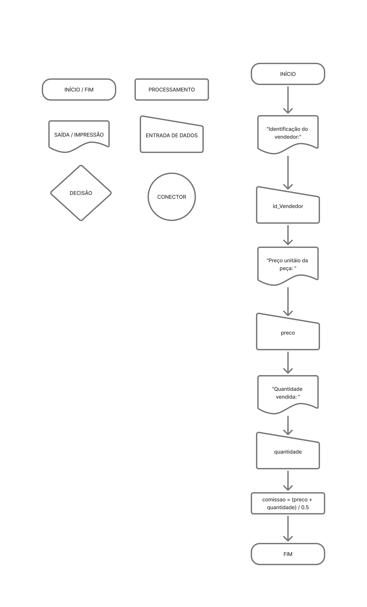
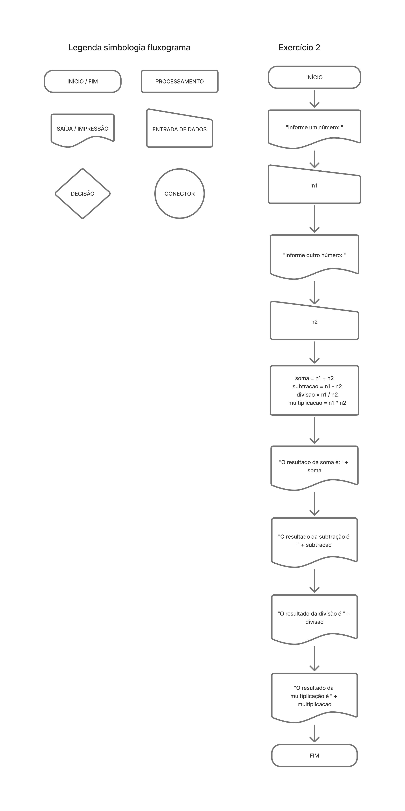
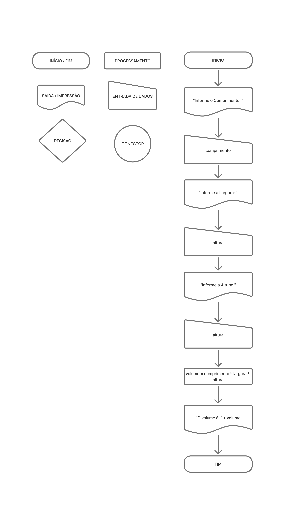
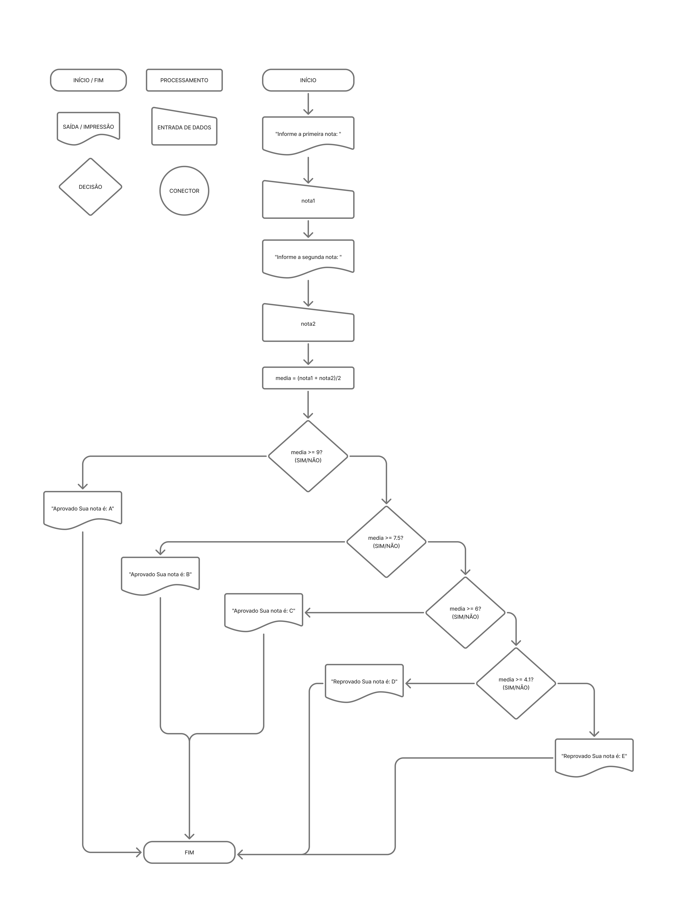
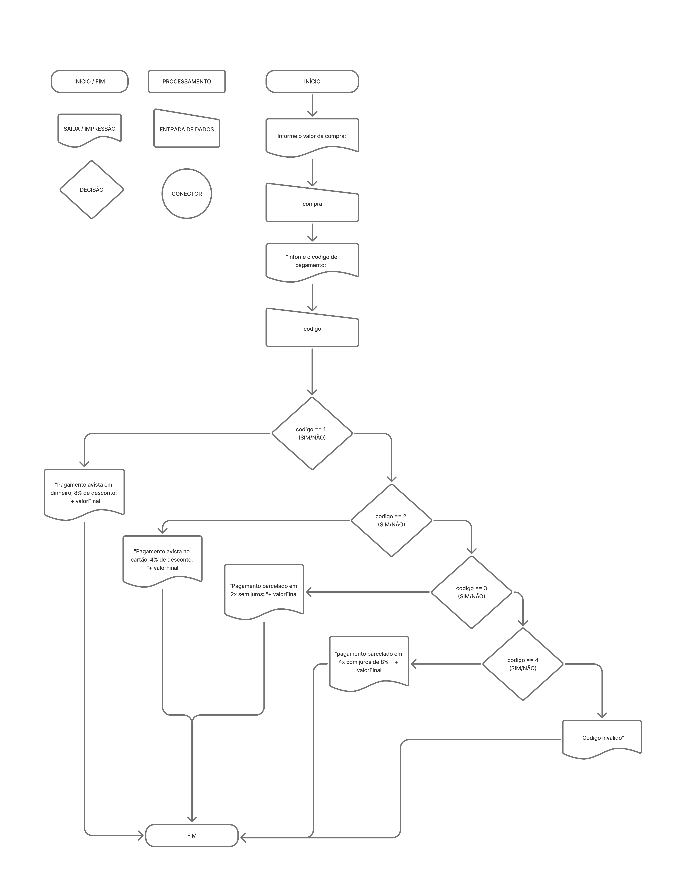
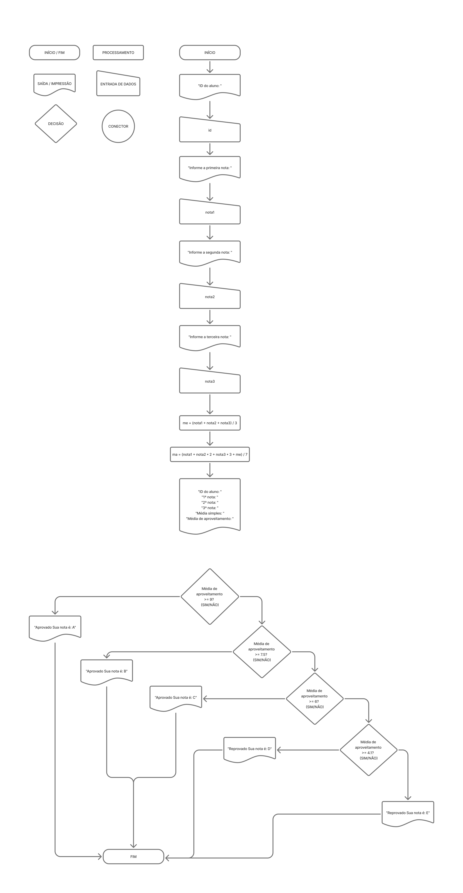
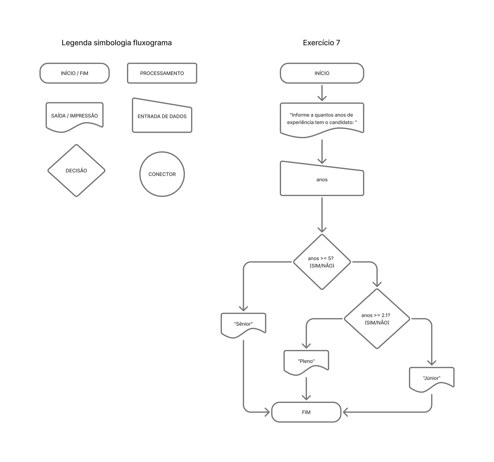
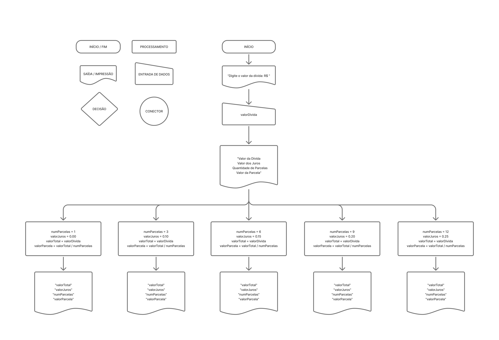
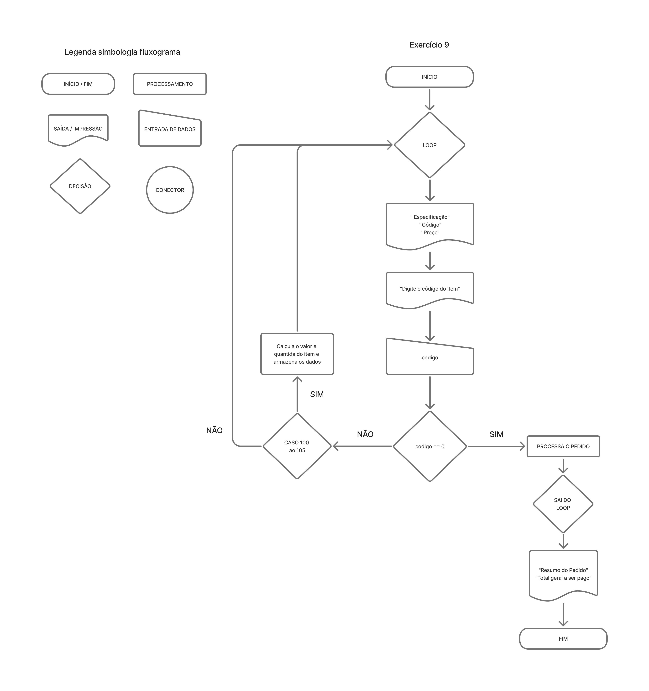

# Desafios Portugol + Fluxograma

Este repositório contém exercícios resolvidos em Portugol, cada um com sua proposta e solução.

---

## Exercício 1

**Proposta:**  
Construa um algoritmo para pagamento de comissão de vendedores de peças automotivas, 
levando em consideração que a comissão do vendedor será de 5% do total da venda. O usuário 
deve inserir os seguintes dados abaixo, e ao final o sistema deve mostrar o valor total da 
compra e o valor da comissão do vendedor:  

    ● Identificação do vendedor  
    ● Código da peça  
    ● Preço unitário da peça  
    ● Quantidade vendida 

**Fluxograma:**  


**Código:**  
```portugol
programa {
  funcao inicio() {
    inteiro id_Vendedor = 0, codigo_peca = 0, quantidade = 0
    real preco = 0, comissao = 0
    escreva("Identificação do vendedor: ")
    leia(id_Vendedor)
    escreva("Código da peça: ")
    leia(codigo_peca)
    escreva ("Preço unitáio da peça: ")
    leia (preco)
    escreva ("Quantidade vendida: ")
    leia (quantidade)
    comissao = (preco + quantidade) / 0.5
    escreva ("Sua comissão é: " + comissao)
  }
}
```

---

## Exercício 2

**Proposta:**  
Construa um algoritmo que leia o nome de um aluno e as notas das três provas que ele obteve no semestre. No final, informar o nome do aluno e a sua média (aritmética).

**Fluxograma:**  


**Código:**  
```portugol
programa {
  funcao inicio() {
    inteiro n1 = 0, n2 = 0, soma = 0, subtracao = 0, divisao = 0, multiplicacao = 0
    escreva("Informe um número: ")
    leia(n1)
    escreva("Informe outro número: ")
    leia(n2)
    soma = n1 + n2
    subtracao = n1 - n2
    divisao = n1 / n2
    multiplicacao = n1 * n2
    escreva ("O resultado da soma é: " + soma + "\n")
    escreva ("O resultado da subtração é " + subtracao + "\n")
    escreva ("O resultado da divisão é " + divisao + "\n")
    escreva ("O resultado da multiplicação é " + multiplicacao + "\n")
  }
}
```

---

## Exercício 3

**Proposta:**  
Elaborar um programa que calcule e apresente o valor do volume de uma caixa retangular, utilizando a fórmula VOLUME = COMPRIMENTO * LARGURA * ALTURA

**Fluxograma:**  


**Código:**  
```portugol
programa {
  funcao inicio() {
    inteiro volume = 0, comprimento = 0, largura = 0, altura = 0
    escreva ("Informe o Comprimento: ")
    leia (comprimento)
    escreva ("Informe a Largura: ")
    leia (largura)
    escreva ("Informe a Altura: ")
    leia (altura)
    volume = comprimento * largura * altura
    escreva ("O valume é: " + volume)
  }
}
```

---

## Exercício 4

**Proposta:**  
Faça um programa que lê as duas notas parciais obtidas por um aluno numa disciplina ao 
longo de um semestre, e calcule a sua média. A atribuição de conceitos obedece à tabela 
abaixo: 

    Média de Aproveitamento     Conceito 
    Entre 9.0 e 10.0            A 
    Entre 7.5 e 9.0             B 
    Entre 6.0 e 7.5             C 
    Entre 4.0 e 6.0             D 
    Entre 4.0 e zero            E 

O algoritmo deve mostrar na tela as notas, a média, o conceito correspondente e a 
mensagem “APROVADO” se o conceito for A, B ou C ou “REPROVADO” se o conceito for D ou E.

**Fluxograma:**  


**Código:**  
```portugol
programa
{
    funcao inicio()
    {
        real nota1 = 0.0, nota2 = 0.0, media = 0.0
        
        escreva("Informe a primeira nota: ")
        leia(nota1)
        
        escreva("Informe a segunda nota: ")
        leia(nota2)
        
        media = (nota1 + nota2) / 2
        
        se (media >= 9)
        {
            escreva("Aprovado \nSua nota é: A")
        }
        senao se (media >= 7.5)
        {
            escreva("Aprovado \nSua nota é: B")
        }
        senao se (media >= 6)
        {
            escreva("Aprovado \nSua nota é: C")
        }
        senao se (media >= 4.1)
        {
            escreva("Reprovado \nSua nota é: D")
        }
        senao
        {
            escreva("Reprovado \nSua nota é: E")
        }
    }
}
```

---

## Exercício 5

**Proposta:**  
Desenvolva um programa que leia o valor de uma determinada compra e o código da forma 
de pagamento. Com base neste código, o programa deverá calcular e imprimir o valor a pagar, 
a forma de pagamento e o valor de cada parcela, se for o caso. 

    Código            Classificação 

    1                 À vista, com 8% de desconto 
    2                 À vista no cartão, 4% de desconto 
    3                 Em 2x, preço normal sem juros 
    4                 Em 4x, preço acrescido de 8% 

Qualquer outro código      Opção inválida

**Fluxograma:**  


**Código:**  
```portugol
programa {
  funcao inicio() {
    inteiro codigo = 0
    real compra = 0, valorFinal = 0, valorParcela = 0
    escreva("Informe o valor da compra: ")
    leia(compra)
    escreva("Infome o codigo de pagamento: ")
    leia(codigo)

    se (codigo == 1){
      valorFinal = compra * 0.92
      escreva("Forma de pagamento: À vista, dinheiro\n")
      escreva("Valor com desconto de 8%: R$", valorFinal)
    }senao se (codigo == 2){
      valorFinal = compra * 0.96
      escreva("Forma de pagamento: À vista, cartão\n")
      escreva("Valor com desconto de 4%: R$", valorFinal)
    }senao se (codigo == 3){
      valorFinal = compra
      valorParcela = valorFinal / 2
      escreva("Forma de pagamento: 2x sem juros\n")
      escreva("Valor total a pagar: R$", valorFinal)
      escreva("\nValor de cada parcela: R$", valorParcela)
    }senao se (codigo == 4){
      valorFinal = compra * 1.08
      valorParcela = valorFinal / 4
      escreva("Forma de pagamento: 4x com juros de 8%\n")
      escreva("Valor total a pagar: R$", valorFinal)
      escreva("\nValor de cada parcela: R$", valorParcela)
    }senao{
      escreva("Codigo invalido")
    }
  }
}
```

---

## Exercício 6

**Proposta:**  
Escreva um programa que leia o número de identificação, as 3 notas obtidas por um aluno 
nas 3 verificações e a média dos exercícios que fazem parte da avaliação, e calcule a média de 
aproveitamento, usando a fórmula: 

    MA := (nota1 + nota 2 * 2 + nota 3 * 3 + ME)/7 

A atribuição dos conceitos obedece a tabela abaixo. O programa deve escrever o número do 
aluno, suas notas, a média dos exercícios, a média de aproveitamento, o conceito 
correspondente e a mensagem 'Aprovado' se o conceito for A, B ou C, e 'Reprovado' se o 
conceito for D ou E. 

    Média de aproveitamento Conceito 

    >= 90 A 
    >= 75 e < 90 B 
    >= 60 e < 75 C 
    >= 40 e < 60 D 
    < 40 E

**Fluxograma:**  


**Código:**  
```portugol
programa {
    funcao inicio() {
        inteiro id = 0
        real nota1 = 0.0, nota2 = 0.0, nota3 = 0.0, ma = 0.0, me = 0.0

        escreva("ID do aluno: ")
        leia(id)
        escreva("Informe a 1ª nota: ")
        leia(nota1)
        escreva("Informe a 2ª nota: ")
        leia(nota2)
        escreva("Informe a 3ª nota: ")
        leia(nota3)

        me = (nota1 + nota2 + nota3) / 3
        ma = (nota1 + nota2 * 2 + nota3 * 3 + me) / 7

        escreva("\n-----------------------------\n")
        escreva("ID do aluno: ", id, "\n")
        escreva("1ª nota: ", nota1, "\n")
        escreva("2ª nota: ", nota2, "\n")
        escreva("3ª nota: ", nota3, "\n")
        escreva("Média simples: ", me, "\n")
        escreva("Média de aproveitamento: ", ma, "\n")

        se (ma >= 9) {
            escreva("Situação: Aprovado\nNota final: A\n")
        } senao se (ma >= 7.5) {
            escreva("Situação: Aprovado\nNota final: B\n")
        } senao se (ma >= 6) {
            escreva("Situação: Aprovado\nNota final: C\n")
        } senao se (ma >= 4.1) {
            escreva("Situação: Reprovado\nNota final: D\n")
        } senao {
            escreva("Situação: Reprovado\nNota final: E\n")
        }
        escreva("-----------------------------\n")
    }
}
```

---

## Exercício 7

**Proposta:**  
Você está programando um sistema para uma empresa de recursos humanos. De acordo 
com o tempo de experiência do candidato você deve informar ao recrutador o nível do 
candidato. Considere: 
    a. Menor que 2 anos → Júnior 
    b. Entre 2 e 5 anos → Pleno 
    c. Acima de 5 anos → Sênior

**Fluxograma:**  


**Código:**  
```portugol
programa {
  funcao inicio() {
    real anos = 0
    escreva("Informe a quantos anos de experiência tem o candidato: ")
    leia(anos)

    se (anos >= 5) {
      escreva("Sênior\n")
    }
    senao se (anos >= 2.1) {
      escreva("Pleno\n")
    }
    senao {
      escreva("Júnior\n")
    }
  }
}
```

---

## Exercício 8

**Proposta:**  
Faça um programa que receba o valor de uma dívida e mostre uma tabela com os seguintes 
dados: valor da dívida, valor dos juros, quantidade de parcelas e valor da parcela. 
Os juros e a quantidade de parcelas seguem a tabela abaixo: 

Quantidade de Parcelas | % de Juros sobre o valor inicial da dívida 

1                       0 
3                       10 
6                       15 
9                       20 
12                      25 

Exemplo de saída do programa: 

 Valor da Dívida | Valor dos Juros | Quantidade de Parcelas | Valor da Parcela 
R$ 1.000,00        0                 1                        R$  1.000,00 
R$ 1.100,00        100               3                        R$    366,00 
R$ 1.150,00        150               6                        R$    191,67

**Fluxograma:**  


**Código:**  
```portugol
programa
{
    funcao inicio()
    {
        real valorDivida, valorJuros, valorTotal, valorParcela
        inteiro numParcelas

        escreva("Digite o valor da dívida: R$ ")
        leia(valorDivida)

        escreva("\n")
        escreva("Valor da Dívida   Valor dos Juros   Quantidade de Parcelas   Valor da Parcela\n")
        
        // Juros de 0% para 1 parcela
        numParcelas = 1
        valorJuros = 0.00
        valorTotal = valorDivida
        valorParcela = valorTotal / numParcelas
        escreva("R$ ", valorTotal, "             ", valorJuros, "                ", numParcelas, "                            R$ ", valorParcela, "\n")
        // Juros de 10% para 3 parcelas
        numParcelas = 3
        valorJuros = valorDivida * 0.10
        valorTotal = valorDivida + valorJuros
        valorParcela = valorTotal / numParcelas
        escreva("R$ ", valorTotal, "             ", valorJuros, "               ", numParcelas, "                            R$ ", valorParcela, "\n")
        // Juros de 15% para 6 parcelas
        numParcelas = 6
        valorJuros = valorDivida * 0.15
        valorTotal = valorDivida + valorJuros
        valorParcela = valorTotal / numParcelas
        escreva("R$ ", valorTotal, "             ", valorJuros, "               ", numParcelas, "                            R$ ", valorParcela, "\n")

        // Juros de 20% para 9 parcelas
        numParcelas = 9
        valorJuros = valorDivida * 0.20
        valorTotal = valorDivida + valorJuros
        valorParcela = valorTotal / numParcelas
        escreva("R$ ", valorTotal, "             ", valorJuros, "              ", numParcelas, "                            R$ ", valorParcela, "\n")

        // Juros de 25% para 12 parcelas
        numParcelas = 12
        valorJuros = valorDivida * 0.25
        valorTotal = valorDivida + valorJuros
        valorParcela = valorTotal / numParcelas
        escreva("R$ ", valorTotal, "             ", valorJuros, "              ", numParcelas, "                           R$ ", valorParcela, "\n")
    }
}
```

---

## Exercício 9

**Proposta:**  
O cardápio de uma lanchonete é o seguinte: 

Especificação   Código  Preço 

Cachorro Quente 100     R$ 1,20 
Bauru Simples   101     R$ 1,30 
Bauru com ovo   102     R$ 1,50 
Hambúrguer      103     R$ 1,20 
Cheeseburguer   104     R$ 1,30 
Refrigerante    105     R$ 1,00 

Faça um programa que leia o código dos itens pedidos e as quantidades desejadas. Calcule e 
mostre o valor a ser pago por item (preço * quantidade) e o total geral do pedido. Considere 
que o cliente deve informar quando o pedido deve ser encerrado.

**Fluxograma:**  


**Código:**  
```portugol
programa
{
    funcao inicio()
    {
        // Declaração de variáveis
        inteiro codigo, quantidade, indice = 0
        real precoItem, totalItem, totalGeral = 0.0
        
        // Arrays para armazenar os detalhes do pedido
        inteiro codigosPedidos[50] // Supondo um máximo de 50 itens no pedido
        inteiro quantidadesPedidos[50]
        real totaisItemPedidos[50]
        cadeia nomesPedidos[50]

        // Loop para ler os pedidos até que o cliente decida encerrar
        faca
        {
            // Exibe o cardápio
            escreva("--- Cardápio da Lanchonete ---\n")
            escreva("Especificação      Código   Preço\n")
            escreva("Cachorro Quente    100      R$ 1,20\n")
            escreva("Bauru Simples      101      R$ 1,30\n")
            escreva("Bauru com ovo      102      R$ 1,50\n")
            escreva("Hambúrguer         103      R$ 1,20\n")
            escreva("Cheeseburguer      104      R$ 1,30\n")
            escreva("Refrigerante       105      R$ 1,00\n")
            escreva("----------------------------\n")
            escreva("Digite 0 para encerrar o pedido.\n")
            escreva("----------------------------\n")

            // Solicita o código do item
            escreva("Digite o código do item: ")
            leia(codigo)

            // Verifica se o cliente quer encerrar o pedido
            se (codigo == 0)
            {
                pare // Sai do loop
            }

            // Solicita a quantidade
            escreva("Digite a quantidade: ")
            leia(quantidade)

            // Estrutura de escolha para determinar o preço e o nome do item
            escolha (codigo)
            {
                caso 100:
                    precoItem = 1.20
                    nomesPedidos[indice] = "Cachorro Quente"
                    escreva("Você pediu Cachorro Quente.\n")
                    pare
                caso 101:
                    precoItem = 1.30
                    nomesPedidos[indice] = "Bauru Simples"
                    escreva("Você pediu Bauru Simples.\n")
                    pare
                caso 102:
                    precoItem = 1.50
                    nomesPedidos[indice] = "Bauru com ovo"
                    escreva("Você pediu Bauru com ovo.\n")
                    pare
                caso 103:
                    precoItem = 1.20
                    nomesPedidos[indice] = "Hambúrguer"
                    escreva("Você pediu Hambúrguer.\n")
                    pare
                caso 104:
                    precoItem = 1.30
                    nomesPedidos[indice] = "Cheeseburguer"
                    escreva("Você pediu Cheeseburguer.\n")
                    pare
                caso 105:
                    precoItem = 1.00
                    nomesPedidos[indice] = "Refrigerante"
                    escreva("Você pediu Refrigerante.\n")
                    pare
                caso contrario:
                    precoItem = 0.0
                    escreva("Código inválido. Por favor, tente novamente.\n")
                    continue // Pula para a próxima iteração do loop
            }
            
            // Calcula o valor do item e armazena os dados
            totalItem = precoItem * quantidade
            totalGeral = totalGeral + totalItem

            codigosPedidos[indice] = codigo
            quantidadesPedidos[indice] = quantidade
            totaisItemPedidos[indice] = totalItem
            
            // Incrementa o índice para o próximo item
            indice = indice + 1

            // Exibe o valor a ser pago pelo item
            escreva("Valor a pagar por este item: R$ ", totalItem, "\n\n")

        } enquanto (verdadeiro) // Loop infinito que é interrompido pelo "pare"

        
        // Exibe o resumo do pedido
        escreva("\n--- Resumo do Pedido ---\n")
        escreva("Item                    Quantidade  Valor\n")

        para (inteiro i = 0; i < indice; i++)
        {
            escreva(nomesPedidos[i], " ", quantidadesPedidos[i], "  R$ ", totaisItemPedidos[i], "\n")
        }
        
        
        // Exibe o total geral do pedido
        escreva("\n--- Pedido Encerrado ---\n")
        escreva("Total geral a ser pago: R$ ", totalGeral, "\n")
        escreva("------------------------\n")
    }
}
```