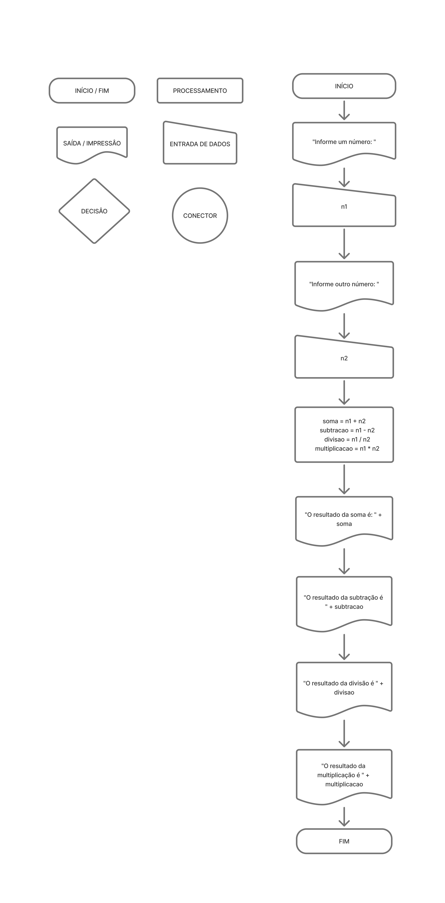

# Desafios Portugol + Fluxograma

Este repositório contém exercícios resolvidos em Portugol, cada um com sua proposta e solução.

---

## Exercício 1

**Proposta:**  
Construa um algoritmo para pagamento de comissão de vendedores de peças automotivas, 
levando em consideração que a comissão do vendedor será de 5% do total da venda. O usuário 
deve inserir os seguintes dados abaixo, e ao final o sistema deve mostrar o valor total da 
compra e o valor da comissão do vendedor:  

    ● Identificação do vendedor  
    ● Código da peça  
    ● Preço unitário da peça  
    ● Quantidade vendida 

**Fluxograma:**  


**Código:**  
```portugol
programa {
  funcao inicio() {
    inteiro id_Vendedor = 0, codigo_peca = 0, quantidade = 0
    real preco = 0, comissao = 0
    escreva("Identificação do vendedor: ")
    leia(id_Vendedor)
    escreva("Código da peça: ")
    leia(codigo_peca)
    escreva ("Preço unitáio da peça: ")
    leia (preco)
    escreva ("Quantidade vendida: ")
    leia (quantidade)
    comissao = (preco + quantidade) / 0.5
    escreva ("Sua comissão é: " + comissao)
  }
}
```

---

## Exercício 2

**Proposta:**  
Elaborar um programa que leia dois valores numéricos reais desconhecidos representados 
pelas variáveis A e B. Calcular e apresentar os resultados das quatro operações aritméticas 
básicas. 

**Fluxograma:**  


**Código:**  
programa {
  funcao inicio() {
    inteiro n1 = 0, n2 = 0, soma = 0, subtracao = 0, divisao = 0, multiplicacao = 0
    escreva("Informe um número: ")
    leia(n1)
    escreva("Informe outro número: ")
    leia(n2)
    soma = n1 + n2
    subtracao = n1 - n2
    divisao = n1 / n2
    multiplicacao = n1 * n2
    escreva ("O resultado da soma é: " + soma + "\n")
    escreva ("O resultado da subtração é " + subtracao + "\n")
    escreva ("O resultado da divisão é " + divisao + "\n")
    escreva ("O resultado da multiplicação é " + multiplicacao + "\n")
  }
}
```

---

<!-- Repita a estrutura para os demais exercícios -->

## Exercício 3

**Proposta:**  
Descreva aqui o texto do exercício 3 conforme está no PDF.

**Fluxograma:**  


**Código:**  
```portugol
// filepath: ./exercicio-3/exercicio_3.por
// ...código do exercício 3...
```